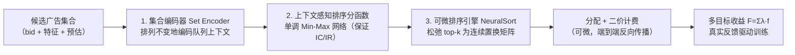
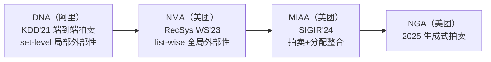

> [!abstract] 一句话结论
> 用「集合编码器 + 单调神经网络 + 可微排序引擎」把 GSP 拍卖的**分配与计费全部参数化为可端到端训练的深度网络**，在保证激励相容（IC）与个体理性（IR）的前提下，直接用历史拍卖的真实反馈优化多利益方指标——这是「神经拍卖 / 学习式机制设计」方向的工业开山之作，阿里淘宝展示广告（AIDA）已上线，双十一峰值近 **100 万次拍卖/秒**。

^dna-oneliner

---

## 一、论文速读摘要

### 1.1 论文元信息

- **标题**：Neural Auction: End-to-End Learning of Auction Mechanisms for E-Commerce Advertising
- **作者**：Xiangyu Liu\*、Chuan Yu\*、Zhilin Zhang、Zhenzhe Zheng（通讯作者）、Yu Rong、Hongtao Lv、Da Huo、Yiqing Wang、Dagui Chen、Jian Xu、Fan Wu、Guihai Chen、Xiaoqiang Zhu（共 13 人，\* 并列一作）
- **机构**：阿里巴巴集团（Alibaba Group）+ 上海交通大学（SJTU）
- **发表状态**：KDD 2021（ACM SIGKDD，Applied Data Science Track），2021-08-14~18，线上会议
- **DOI**：10.1145/3447548.3467103
- **arXiv**：2106.03593（2021-06-07 初版 v1，2021-07-14 修订 v2）
- **代码**：**无官方开源**（摘要与正文均未提及 code available，复现需自行实现）

### 1.2 核心贡献（3 句话版本）

1. 提出了 **DNA（Deep Neural Auction）**，一个端到端可学习的电商广告拍卖机制，由「集合编码器（Set Encoder）+ 上下文感知排序分函数（Context-Aware Rank Score Function）+ 可微排序引擎（Differentiable Sorting Engine）」三大模块构成。
2. 用 NeuralSort 的 softmax 松弛把离散 top-k 排序变为可微操作、用部分单调 Min-Max 网络约束排序分对 bid 单调，一举解决「拍卖离散操作与深度学习连续优化不兼容」与「样本歧义导致数据效率低」两大挑战，实现多目标端到端优化且保证 IC/IR。
3. 在淘宝展示广告系统（AIDA）的大规模离线数据与线上 A/B 中验证，DNA 相对 GSP / uGSP / Deep GSP 在多目标（RPM、CTR、GMV 等）上显著更优，并已实际部署上线。

---

## 二、问题定义与创新点分析

### 2.1 核心问题

电商广告平台是「用户 / 广告主 / 平台」三方博弈的中间人，需要**同时**优化用户体验、广告主效用与平台收入等多指标，且这些指标的权重还会随业务策略动态调整。传统机制的痛点：

- **VCG / Myerson**：要么只优化社会福利、要么只优化收入，且流程复杂、对广告主不可解释。
- **GSP**：解释性好、易部署，但**分配规则固定**，只能优化单一指标，无法在动态环境下优化多指标。
- **uGSP（Utility-based GSP）**：仍是 eCPM 与其他指标的**线性组合**，解空间存在天花板；且是「静态」机制，严重依赖预估模型精度，无法直接对标终局效果做自适应调控。

学习式（data-driven）拍卖从历史拍卖结果直接学机制，能扩大机制设计空间、优化多目标。但要把它做成工业可用的深度模型，还面临两大挑战：

1. **离散 vs 连续的不兼容**：拍卖的分配与计费包含大量离散操作（如 top-k 选择、排序），与深度学习的端到端连续优化流程矛盾，导致「拍卖结果里的反馈信号无法反向传播到模型训练」。
2. **数据效率低（歧义性 ambiguity）**：同一广告主特征在不同拍卖中可能「一次赢、一次输」（因为对手/上下文变了），形成 one-to-many 的样本歧义；不注入归纳偏置的朴素神经网络学不好这种数据。

> [!note] 本文关键建模前提
> 工业界电商广告主已不是传统「效用最大化者（utility-maximizer）」，而是 **Value Maximizer**（如 OCPC、MCB 类型广告主）：在扣费不超过其支付意愿的约束下，最大化点击/成交等营销目标（value）。对 Value Maximizer，机制的 **IC + IR 等价于**：① **单调分配**（出价更高不能拿到更差坑位）；② **临界价计费**（扣费 = 维持当前坑位所需的最低出价）。这两点正是 DNA 网络结构设计的硬约束。

### 2.2 技术创新层次分析

| 创新层次 | 描述 | 工程价值 |
|---------|------|---------|
| **结构创新** | 集合编码器（DeepSets）：排列不变地编码整个竞价队列上下文，辅助每个广告推断自身竞争力 | 中等复杂度，直接提升排序分表达力 |
| **原理/结构创新** | 上下文感知排序分函数（Partially Monotone Min-Max Network）：对 bid 单调 + 可求逆，结构上保证 IC/IR | 高风险高回报，需机制设计理论支撑 |
| **训练策略创新** | 可微排序引擎（NeuralSort）：把离散 top-k 排序松弛为连续置换矩阵，打通端到端反向传播 | 改动适中，是端到端训练的关键 |
| **训练策略创新** | 双损失（收益最大化 L_tgt + 排序矫正交叉熵 L_ce）+ 稀疏反馈的后验校准 | 易落地，直接提升训练稳定性与数据效率 |

### 2.3 与已有方法对比

| 方法 | 分配规则 | 外部性/上下文建模 | 多目标 | IC/IR 保证 | 工业部署 |
|------|---------|----------------|--------|-----------|---------|
| GSP | 固定 eCPM 排序 | 无 | 单目标 | 有 | 基准 |
| uGSP | eCPM + 指标线性组合 | 无 | 弱（线性） | 有 | 高 |
| Deep GSP（Zhang 2021） | 学习式排序分 | 无（point-wise） | 有 | 有 | 高 |
| VCG / Myerson | 固定规则 | 理论可建模 | 单目标 | 有 | 低（不可解释/收入低） |
| 纯学术学习式拍卖（RegretNet 等） | 网络参数化 | 理论设定 | 有 | 近似 | 低（无工业落地） |
| **DNA（本文）** | **学习式排序分 + set-level 上下文** | **局部（set-level）** | **有（λ 加权）** | **有（结构保证）** | **高（已上线）** |

> [!note] DNA 的「外部性」边界（关键局限）
> DNA 的集合编码器只建模 **set-level 上下文**（整个竞价队列作为无序集合），**不建模广告顺序与展示位置**。这正是后续美团 [[NMA_论文解读|NMA]]（list-wise 全局外部性）超越 DNA 的切入点——阅读本文时务必把这条「局部 vs 全局外部性」的递进关系记在心里。

^dna-externality

### 2.4 局限性识别

- **只建模局部（set-level）外部性**：忽略广告排序/位置外部性，多槽场景下仍次优。
- **无开源代码**：可微排序 + 单调网络 + 端到端奖励训练需从零实现，复现门槛高。
- **依赖完整拍卖基建**：竞价日志、pCTR/pCVR 预估、计费/结算链路缺一不可，纯学术环境难以直接套用。
- **结论偏定性**：论文表格展示帕累托前沿与 Regret 指标，正文摘要未给统一百分比数字，具体提升需看实验图表。
- **KDD ADS Track（应用数据科学赛道）**：偏工业落地，机制设计理论深度弱于理论顶会（EC / NeurIPS 的 mechanism design 工作）。

---

## 三、方法解析（DNA 三模块）

### 3.1 整体框架

DNA 坚持 GSP「基于排序分分配 + 二价计费」的设计思路（解释性好、易部署），把排序分函数升级为深度网络，并把整个拍卖流程做成端到端可微：

### 3.2 集合编码器（Set Encoder）

- **动机**：候选参竞集合是**无序**的，上下文特征提取必须满足**排列不变性（permutation invariance）**。
- **结构**：采用 DeepSets 范式——先对每个广告特征 $x_j$ 用共享全连接 $\phi_1$ 映射到隐空间 $h_j=\sigma(\phi_1(x_j))$，对「除自己以外的其他广告」做平均池化，再经 $\phi_2$ 输出集合表示 $h'_i=\sigma(\phi_2(\mathrm{avgpool}(\{h_j\}_{j\ne i})))$。
- **关键设计**：集合编码器**不引入 bid**，bid 只在下游排序分函数中出现，从而保证排序分对 bid 的单调性不被破坏。

### 3.3 上下文感知排序分函数（Context-Aware Rank Score Function）

- **输入**：广告自身出价 $b_i$ + 其余特征 $x'_i$（含广告自身特征 + 集合编码器输出的上下文 $h'_i$）。
- **结构**：Partially Monotone Min-Max Network，所有广告**共享**该网络：

$$r_i = \min_{q\in[Q]}\ \max_{z\in[Z]}\ \big(e^{w_{qz}}\cdot b_i + w'_{qz}\cdot x'_i + \alpha_{qz}\big)$$

- **性质 ①（对 bid 单调）**：$e^{w_{qz}}$ 恒正，保证输出 $r_i$ 随 $b_i$ 单调递增 → 满足 Value Maximizer 的「单调分配」。
- **性质 ②（可求逆）**：该结构已被证明是通用非线性函数逼近器，且**求逆只需交换 min/max 与符号**。已知后一位广告的排序分 $r_{i+1}$，广告 $i$ 的临界价计费为：

$$p_i = \max_{z\in[Z]}\ \min_{q\in[Q]}\ e^{-w_{qz}}\big(r_{i+1} - \alpha_{qz} - w'_{qz}\cdot x'_i\big)$$

- **含义**：二价计费「扣费 = 维持当前坑位的最低出价」这一 IC/IR 条件被**结构性内置**到网络里，不会学出一个可被广告主操纵的机制。

### 3.4 可微排序引擎（Differentiable Sorting Engine）

- **动机**：排序/top-k 是离散不可导操作，是端到端训练的最大障碍。
- **结构**：采用 NeuralSort，把「按分数降序取 top-k」松弛为**每个广告排到每个位置的概率**。令排序分向量 $r=[r_1,\dots,r_N]^T$，构造置换矩阵的连续近似 $\hat M_r\in\mathbb{R}^{K\times N}$：

$$\hat M_r[k,:]=\mathrm{softmax}\Big(\frac{c_k}{\tau}\Big),\quad c_k=(N+1-2k)\,r-A_r\,\mathbf{1},\quad A_r[i,j]=|r_i-r_j|$$

- $\tau$ 是温度超参（控制松弛程度）；$\hat M_r[k,i]$ 表示广告 $i$ 排在第 $k$ 位的概率。
- **作用**：作为「DNN 排序分 → 排序结果 → 基于排序的真实反馈」之间的**可微桥梁**，使 top-k 收益等指标可写成 $\sum_i \hat M_r[i,:]\cdot F_{all}$ 的形式参与反向传播。
- **推理时**：取 $\tau=0$ 退化为硬排序，保证线上确定性决策与极低延迟。

### 3.5 训练流程

- **样本特征**：bid、预估分（pCTR / pCVR）、商品特征（品类/笔单价）、用户特征（性别/年龄段）、上下文（场景/产品类型）、统计特征；训练信号来自历史日志的**真实反馈**（点击、加购、成交）。
- **损失 L_tgt（收益最大化）**：用松弛置换矩阵构造近似期望收益，$-\hat M_r[i,:]\cdot F_{all}$。注意平台收入不直接取后验值，而是**按当前排序分实时算定价与收入**（因为定价依赖排序结果）。
- **损失 L_ce（排序矫正）**：根据后验反馈算出「真实最优排序」，用交叉熵让模型产生的排序逼近它。
- **训练经验**（论文明确指出的坑）：
  - 只优化 revenue 时 L_tgt 可独立训练，但 learning curve 有毛刺（因收入依赖 rankscore 求逆，distance 被显式优化带来不稳定）；
  - 多目标权衡时 L_tgt 与 L_ce 权重应同量级，或**先学 L_ce 学好 allocation，再引入 L_tgt 精细化 revenue**；
  - 真实反馈稀疏 → 用后验校准技术纠正预估值，再构造两个 loss，提高训练稳定性。

---

## 四、实验与效果

### 4.1 离线实验

- **基线**：GSP、uGSP、Deep GSP。
- **设定**：每次只取两个目标（RPM + X 模式，X ∈ {CTR / GMV / CVR…}）做帕累托对比。
- **结论**：DNA 的**帕累托前沿更优**、目标间置换比更高——即「损失同等 RPM 时其他指标提升更多」，说明 DNA 在双目标上的自适应调控能力强于 uGSP / Deep GSP。

### 4.2 激励相容（IC）验证：Regret 指标

- 受 data-driven IC metric 启发，定义 Value Maximizer 广告主的**后悔值（Regret）**：对 bid 做扰动后，广告主 value 获得提升的最大占比、payment 降低的最大占比。
- 在真实广告日志上模拟 bid 扰动：**DNA 的 Regret 仅在 value 一项上非零且占比很低**，对比非 IC 的一价拍卖（uGFP）优势明显，验证了 DNA 的 IC 性质。

### 4.3 在线 A/B

- **vs Deep GSP**：损失相同 RPM 下获得其他指标的提升，置换比更优。
- **vs GSP**：融合多目标的 DNA 在**所有指标上均优于 GSP**，体现「广告主 / 平台 / 用户体验多方共赢」的调控能力。

### 4.4 部署

- 部署于淘宝展示广告系统 **AIDA（Advertisement Intelligent Decision-mAking system）**。
- 线上服务含特征提取、排序分计算、可微排序（$\tau=0$）分配与计费三大组件；**上一届双十一峰值支撑近 100 万次广告拍卖/秒**，验证了工程可行性。

---

## 五、工程落地可行性评估

### 5.1 数据需求

| 维度 | 评估 |
|------|------|
| 数据量 | 淘宝竞价日志，工业规模（无需人工标注，点击/成交为自然反馈） |
| 特征依赖 | 依赖 pCTR/pCVR 预估、商品/用户/上下文特征，**不依赖知识图谱/多模态** |
| 标注成本 | 无（后验反馈 + 预估值校准） |
| 特殊要求 | 需完整竞价队列（含落选广告的 bid 与特征），对日志质量要求高 |

### 5.2 计算开销

- **训练**：排序分网络本身轻量（全连接 Min-Max 网络），但端到端含可微排序 + 收入求逆，中等 GPU 即可。
- **推理（关键）**：$\tau=0$ 退化为硬排序，前向只做「集合编码 + 排序分 + 排序」，延迟极低，**已用近百万 QPS 验证**。
- **内存**：集合编码器需对整队广告做前向，需控制候选集大小。

### 5.3 实现复杂度评估

| 维度 | 评估 |
|------|------|
| 依赖框架 | PyTorch 标准模块可搭，但可微排序、单调网络求逆需**自定义算子**，中高复杂度 |
| 是否有代码 | **无官方开源**，需从零实现或参考第三方复现 |
| 数学难度 | 需拍卖机制设计（IC/IR/单调/临界价）+ 可微排序背景，**需特定领域基础** |
| 系统改造 | 拍卖机制与排序/计费链路深度耦合，**架构级改动** |

### 5.4 综合落地评分：⭐⭐⭐⭐（4/5）

- **优点**：KDD 工业赛道 + 阿里真实部署 + 线上 A/B + 百万 QPS，思路与价值已被充分验证；三大模块（DeepSets / 单调网络 / NeuralSort）都是成熟可复用组件。
- **风险**：无代码、依赖拍卖基建、可微排序与端到端奖励训练实现成本高。
- 对有广告拍卖基建的团队：⭐⭐⭐⭐⭐；对无此基建的团队：⭐⭐⭐。

---

## 六、复现步骤拆解

### Phase 1：快速验证（1–3 天）
1. 精读 Method 与附录公式，理清三模块与 IC/IR 的对应关系。
2. 用合成竞价数据搭最小 demo：单调 Min-Max 网络排序分 + NeuralSort 可微排序，验证「排序分随 bid 单调」「求逆可计费」两件事跑通。

### Phase 2：离线复现（3–7 天）
1. 数据适配：把竞价日志对齐成「候选队列（bid+特征+预估）+ 中标列表 + 计费 + 后验反馈」格式（注意要包含落选广告）。
2. 实现三模块：DeepSets 集合编码器 → Partially Monotone Min-Max 网络 → NeuralSort 可微排序。
3. 加双损失 L_tgt + L_ce，按论文经验「先学 allocation 再精细化 revenue」；先用论文超参，再在内部数据上调优。
4. 离线对比 GSP / uGSP / Deep GSP，画 RPM+X 帕累托前沿；用 bid 扰动算 Regret 验证 IC。

### Phase 3：工程化（1–2 周）
1. 推理时 $\tau=0$ 硬排序，导出/量化降延迟。
2. 收入实时计算与计费链路对齐，防 Training-Serving Skew（训练/线上特征与预估完全一致）。
3. 压测 P99 延迟（参考论文百万 QPS）。
4. 小流量 AB，监控多指标与广告主侧 ROI/预算消耗。

### 关键复现检查点
- [ ] 帕累托前沿相对 GSP/uGSP 是否正提升
- [ ] Regret（bid 扰动）是否接近 0，IC 是否成立
- [ ] 训练是否稳定（L_tgt 毛刺、双损失权重是否同量级）
- [ ] 线上硬排序替换软排序后，效果损失是否可接受

---

## 七、美团业务场景适配建议

> [!important] 特别说明
> DNA 是「神经拍卖」路线的**工业开山作与美团后续工作的直接对标 baseline**。美团已在 [[NMA_论文解读|NMA]]（list-wise 全局外部性）与 [[MIAA_论文精读|MIAA]]（拍卖+分配整合）上做出了超越 DNA 的自家方案。因此本文对美团的价值不是「照搬」，而是：**复用 DNA 的三大工程组件（可微排序 / 单调网络 / 集合编码），并把它作为美团方法的能力下限与对比锚点。**

### 7.1 分场景适配分析

| 场景 | 适配点 | 挑战 |
|------|--------|------|
| **外卖/到店广告** | DNA 的「学习式排序分 + 可微排序」可直接复用；可把 LBS、时段、品类层级作为上下文入集合编码器 | 广告位置少、上下文/外部性强，DNA 的 set-level 建模不够，需升级为 list-wise（即 NMA 思路） |
| **搜索广告** | Query 作为上下文入集合编码器，建模 Query-广告相关性 | 候选量级大（百万级），集合编码器需控制复杂度 |
| **信息流/混排广告** | 广告与原生内容混排外部性更强，DNA 思路可作基础，但需显式建模与原生内容的外部性 | 需扩展到广告+原生联合拍卖（美团后续工作方向） |
| **风控/流量质量** | 机制层的 IC 保证 + Regret 度量可迁移用于「反操纵」评估 | 风控对可解释性/监管合规要求更高，纯黑盒排序分需补充解释 |

### 7.2 改进方向

1. **外部性升级**：把 DNA 的 set-level 集合编码升级为 **list-wise**（建模顺序 + 位置外部性），即美团 NMA 已做的事。
2. **机制整合**：把「拍卖（计费）+ 分配（placement）」联合优化，走向 Deep Automated Mechanism Design（[[MIAA_论文精读|MIAA]]）。
3. **多目标 + 长期价值**：在 λ 加权多目标基础上，引入广告主 ROI/预算消耗、用户体验负反馈、长期价值（treatment effect）约束。
4. **Auction Agent × Auto-bidding Agent 协同**：DNA 只优化机制侧，未触及「拍卖智能体与智能出价智能体」的动态博弈，这是论文自己点名的开放方向。

### 7.3 演进脉络（本文在美团体系中的定位）

---

## 八、注意事项与风险提示

> [!warning] 风险提示
> 1. **可信度**：KDD 2021 主会（ADS Track）+ 阿里工业团队 + 真实部署 + 百万 QPS，工业可信度高；但偏应用，理论创新弱于机制设计理论顶会。
> 2. **数值口径**：不同数据集 RPM/AUC 不可横向比较，只看相对提升（delta）；论文表格以帕累托前沿与 Regret 为主，无统一百分比，具体数值以正文图表为准。
> 3. **无代码**：可微排序 + 单调网络 + 端到端奖励训练需自行实现，是最大工程门槛。
> 4. **场景依赖**：依赖拍卖基建与计费链路，普通推荐系统无法直接复用。
> 5. **时效性**：2021 年的 SOTA，如今已被美团 NMA/MIAA/NGA 等 list-wise / 生成式方案超越，复现前务必结合后续工作一起评估。
> 6. **已建索引**：本文属「广告拍卖 + 外部性建模」主线的**起点/对标项**，详见 [[神经拍卖与外部性建模_索引]]。
