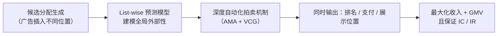

> [!info] 相关笔记
> 本文与同一团队的前作 [[NMA_论文解读|NMA（Neural Multi-slot Auctions）]] 同属"神经拍卖 / 外部性建模"脉络，可对照阅读。

## 一、论文核心信息摄取

### 1.1 论文元信息

| 属性 | 内容 |
|------|------|
| 标题 | Deep Automated Mechanism Design for Integrating Ad Auction and Allocation in Feed |
| 简称 | MIAA (Mechanism for Integrating ad Auction and Allocation) |
| 作者 | Xuejian Li, Ze Wang, Bingqi Zhu, Fei He, Yongkang Wang, Xingxing Wang |
| 所属机构 | 美团 (Meituan), 北京 |
| 发表会议 | SIGIR 2024 (第47届ACM信息检索研究与发展大会) |
| 会议时间 | 2024年7月14-18日, 华盛顿特区 |
| 发表年份 | 2024 |
| arXiv提交 | 2024年1月3日 (v1), 2024年4月11日 (v2) |
| 代码开源 | 论文未明确提及开源代码 |
| 研究领域 | cs.GT (博弈论), cs.AI (人工智能) |

### 1.2 问题定义

**核心问题**: 在电商信息流场景中，广告拍卖 (Ad Auction) 和广告分配 (Ad Allocation) 通常被分为两个独立阶段执行。这种分离导致了两个关键问题：

1. **广告拍卖未考虑外部性 (Externalities)**: 传统拍卖机制（如GSP）基于"分离CTR假设"，即广告的CTR仅与广告本身相关，不受展示位置和上下文（周围自然结果）的影响。但在实际信息流中，广告被自然结果包围，其CTR会受到实际展示位置和上下文的显著影响。外部性导致广告主之间产生复杂的策略竞争，传统拍卖无法获得稳定结果和社会福利最大化。

2. **广告分配阶段不满足激励兼容性 (IC)**: 在GSP拍卖中，获胜广告的支付取决于第二名广告的出价，而非自身出价。即使获胜广告提高出价，其支付也不变。这意味着广告无法通过提高出价获得更好的展示位置，失去了在分配阶段获取更高效用的机会。同时，如果广告主可以无成本地通过提高出价来获取最佳位置，平台GMV损失可能超过收入增长。

**现有方法的痛点**: 以往研究往往只关注拍卖或分配中的一个阶段，忽略了两个阶段之间的交互影响，导致次优结果。

**解决思路（一句话概括）**: 提出MIAA——一个基于仿射最大化拍卖 (AMA) 和VCG思想的深度自动化机制，通过深度神经网络端到端地同时决定广告的排名、支付和展示位置，在 ==外部性== 存在的情况下保证 ==IC== 和 ==IR==，同时最大化平台收入和GMV。

### 1.3 核心贡献（3句话版本）

1. 提出了MIAA，一个整合广告拍卖和分配的深度自动化机制，通过候选分配生成、list-wise预测模型建模全局外部性、以及深度神经网络建模的自动化拍卖机制三步流程，同时决定广告的排名、支付和展示位置。

2. 解决了传统两阶段分离方法中广告拍卖不考虑外部性、广告分配不满足IC的问题，是首个考虑并解决由广告拍卖和分配分离导致的外部性和IC问题的研究。

3. 在美团零售信息流的离线实验和在线A/B测试中，MIAA在平台收入和GMV两方面均显著优于state-of-the-art基线方法，已成功部署于美团生产系统。

---

## 二、创新点与已有方法对比

### 2.1 技术创新层次分析

| 创新层次 | 描述 | 工程价值 |
|----------|------|----------|
| **原理创新** | 首次将广告拍卖与分配整合为统一的机制设计问题，在外部性存在条件下同时保证IC和IR | 高风险高回报，开辟了混排机制设计的新范式 |
| **结构创新** | 提出三步走的架构：候选分配生成 → list-wise全局外部性建模 → 深度神经网络自动化拍卖 | 中等复杂度，架构清晰，可适配现有系统 |
| **训练策略创新** | 基于AMA+VCG的机制参数化，通过端到端学习最大化收入和GMV，同时利用regret minimization保证经济性质 | 经济性质约束融入训练目标，理论保证强 |

### 2.2 与已有方法的系统性对比

#### 2.2.1 外部性感知的广告拍卖设计

论文梳理了CTR外部性建模的演进路线：

| 方法 | 外部性建模范围 | 机制设计 | 局限性 |
|------|---------------|---------|--------|
| Ghosh & Mahdian (2008) | 广告间点击交互（choice model） | VCG-style支付 | 仅考虑广告间外部性，未考虑自然结果 |
| Cascade Model (Kempe等) | 基于用户自上而下浏览的局部外部性 | GSP或VCG | 仅建模位置局部影响 |
| DNA (Liu等, 2021) | 候选广告集上的局部外部性 | — | 未建模全局上下文 |
| DPIN (Huang等, 2021) | 广告位置的局部外部性 | — | 未建模广告与自然结果的交互 |
| EXTR (Chen等, 2022) | 全局外部性 | — | 建模了全局外部性但未考虑后续拍卖机制设计 |
| **MIAA (本文)** | **全局外部性 (广告+自然结果)** | **深度自动化拍卖 (AMA+VCG)** | **首个同时解决外部性和IC问题的整合机制** |

#### 2.2.2 广告分配方法

| 方法类别 | 代表工作 | 是否满足IC/IR | 特点 |
|----------|---------|-------------|------|
| 动态分配（不考虑拍卖排名） | Yan等(2020), Zhang等(2018), Zhao等(2021) | 否 | 灵活但不满足经济性质 |
| 保持广告相对排名的分配 | Wang等(2022), Shi等(2023), Liao等(2021) | 是 | 保证IC但分配与拍卖割裂 |
| 搜索场景整合机制 | Li等(2023b) | 是 | 分离CTR假设 + 价值分布公开已知 |
| **MIAA (本文)** | — | **是** | **打破分离CTR假设，外部性感知，端到端学习** |

#### 2.2.3 与经典拍卖机制对比

| 机制 | 是否考虑外部性 | IC保证 | IR保证 | 收入水平 | 分配决策 |
|------|-------------|--------|--------|---------|---------|
| GSP | 否 | 是（在分离CTR假设下） | 是 | 较高 | 仅决定排名和支付，不决定位置 |
| VCG | 可扩展 | 是 | 是 | 低于GSP | 可考虑外部性但收入不理想 |
| **MIAA** | **是（全局外部性）** | **是** | **是** | **高于VCG，与GSP相当或更优** | **同时决定排名、支付和位置** |

### 2.3 MIAA的核心创新点深度分析

**创新点1: 整合拍卖与分配的统一机制设计**

传统方法将拍卖和分配视为独立阶段，MIAA将其统一为一个机制设计问题。机制同时输出三个决策：(1) 哪个广告获胜（排名）；(2) 广告的支付金额（支付）；(3) 广告在信息流中的展示位置（分配）。这种统一设计从根本上消除了两阶段割裂带来的IC问题和外部性忽略问题。

**创新点2: ==全局外部性==建模**

MIAA不采用传统的"分离CTR假设"（即CTR仅与广告本身有关），而是通过list-wise预测模型，将整个分配列表（包含广告和自然结果）作为输入，输出每个item的预测结果。这样可以直接建模广告与周围自然结果之间的全局交互影响，更准确地反映实际CTR。

**创新点3: 基于AMA+VCG的深度自动化机制**

受仿射最大化拍卖 (Affine Maximizer Auction, AMA) 启发，MIAA用深度神经网络参数化拍卖机制的分配规则和支付规则。分配规则从候选分配中选择最大化加权社会福利的方案，支付规则基于VCG思想设计以确保IC和IR。机制参数通过端到端方式学习，训练目标直接优化平台收入和GMV。

### 2.4 局限性识别

> [!warning] 局限性
> 1. **计算复杂度**: 对每个候选广告生成多个候选分配，再对每个候选分配运行list-wise模型预测，候选方案的组合数量为 O(n × m)（n个候选广告 × m个位置），在高并发场景下推理开销可能较大。
>
> 2. **单广告位假设**: 论文考虑的是每次页面请求只展示一个广告的场景，多广告位场景的扩展性未在论文中讨论。
>
> 3. **外部性模型的准确性**: list-wise预测模型的质量直接影响机制效果，如果预测模型对外部性的建模不够准确，可能导致社会福利计算偏差。
>
> 4. **论文基于arXiv预印本和SIGIR发表**: 虽然SIGIR是CCF-A类会议，但论文的某些实验细节（如具体的超参数设置、模型架构细节）可能在正文中描述有限。

---

## 三、工程落地可行性评估

### 3.1 数据需求评估

| 维度 | 评估 | 说明 |
|------|------|------|
| **训练数据量** | 工业规模（>1亿） | 论文使用美团零售信息流的生产数据，属于超大规模数据。普通团队难以完全复现，但可在子集上验证 |
| **特征依赖** | 中等 | 主要依赖广告和自然结果的特征（如商品信息、用户特征、位置特征），不需要特殊特征（如知识图谱/多模态）。但list-wise模型需要整个分配列表作为输入，特征组织方式与传统point-wise模型不同 |
| **数据标注成本** | 低 | 使用点击和转化日志作为隐式反馈，不需要人工标注。训练标签来自用户行为日志（点击、购买等） |
| **数据特殊要求** | 需要候选分配的构造 | 需要为每个请求构造候选分配（广告插入到不同位置），并记录实际展示结果用于训练 |

### 3.2 计算开销评估

| 维度 | 评估 | 说明 |
|------|------|------|
| **训练阶段GPU需求** | 中等 | 深度神经网络模型，需要GPU训练，但模型规模可控（非大模型级别）。美团生产环境通常有充足GPU资源 |
| **训练时长** | 适中 | 端到端训练，需要同时优化机制参数和经济性质约束，可能比传统CTR模型训练时间更长 |
| **推理阶段延迟** | 需重点关注 | 每次请求需生成 n×m 个候选分配，对每个候选分配运行list-wise模型，再执行拍卖机制选择最优方案。推理延迟取决于候选分配数量和模型复杂度 |
| **是否可离线预计算** | 部分可以 | list-wise模型的部分特征可以离线预计算（如item embedding），但候选分配的评分和拍卖机制决策必须在线实时计算 |
| **内存占用** | 中等 | 主要消耗在list-wise模型的参数和item embedding存储上 |

### 3.3 实现复杂度评估

| 维度 | 评估 | 说明 |
|------|------|------|
| **依赖框架** | 中等复杂度 | 需要PyTorch/TensorFlow标准模块 + 自定义机制设计层（分配规则和支付规则的神经网络实现） |
| **是否有代码** | 无官方开源代码 | 需要从论文描述中自行实现，增加了复现难度 |
| **数学难度** | 高复杂度 | 需要博弈论和机制设计的深厚理论基础（AMA、VCG、IC、IR、社会福利最大化、regret minimization），同时需要深度学习工程能力 |
| **系统改造** | 高复杂度 | 需要将传统两阶段架构（拍卖 → 分配）重构为统一的单阶段机制，涉及整体架构变更 |

### 3.4 综合落地评分

> [!important] 综合落地评分
> **评分: ⭐⭐⭐ (可以尝试，需要较多工程投入)**
>
> **理由**:
> - 论文来自美团团队，已在美团零售信息流生产环境部署，工业可行性已得到验证，这是最大的正面因素。
> - 但实现需要同时具备博弈论/机制设计理论基础和深度学习工程能力，团队配置要求较高。
> - 无开源代码，从零实现需要深入理解AMA+VCG的参数化方法和端到端训练流程。
> - 系统架构改造较大，从两阶段变为单阶段统一机制，需要重构现有广告系统。
> - 推理延迟是关键瓶颈，需要在工程上做大量优化（如候选分配剪枝、模型蒸馏等）。

---

## 四、复现步骤拆解

### Phase 1: 快速验证（1-3天）

1. **深入理解理论基础**:
   - 复习机制设计核心概念：IC (激励兼容性)、IR (个体理性)、社会福利最大化
   - 理解AMA (Affine Maximizer Auction) 机制：分配规则为加权社会福利最大化，支付规则为VCG-style
   - 理解外部性对传统拍卖机制的挑战：为什么GSP在外部性存在时不满足IC

2. **精读论文Method章节**:
   - 理解MIAA的三步流程：候选分配生成 → list-wise预测 → 自动化拍卖
   - 理解分配规则和支付规则的神经网络参数化方式
   - 理解端到端训练目标：收入+GMV最大化 + 经济性质约束（regret minimization）

3. **构造简单示例验证**:
   - 使用小规模数据（如10个广告、5个自然结果、3个位置）
   - 手动构造候选分配，验证list-wise模型输入输出格式
   - 验证AMA分配规则和VCG支付规则在简单场景下的正确性

### Phase 2: 离线复现（3-7天）

1. **数据准备**:
   - 从生产日志中采样训练数据，包含：用户特征、广告特征、自然结果特征、广告出价、实际展示位置、点击/转化标签
   - 构造候选分配：对每个请求，将每个候选广告插入到自然结果列表的不同位置，生成候选分配集合
   - 数据格式：每个样本包含一个请求的所有候选分配及其list-wise特征和标签

2. **模型实现**:
   - **List-wise预测模型**: 实现一个能接受整个分配列表作为输入的模型（可基于Transformer/attention结构），输出每个item的预测CTR/CVR
   - **分配规则网络**: 参数化的加权社会福利最大化，从候选分配中选择最优方案
   - **支付规则网络**: 基于VCG思想的支付计算，保证IC和IR
   - **训练损失**: 结合收入目标、GMV目标和经济性质约束（regret）

3. **超参数调优**:
   - 学习率、batch size、网络深度/宽度
   - 收入和GMV目标的权重平衡
   - 经济性质约束的强度（regret penalty系数）
   - list-wise模型的attention head数量和层数

4. **离线评估**:
   - 对比基线：GSP + 动态分配（传统两阶段方法）
   - 评估指标：平台收入、GMV、IC regret（衡量激励兼容性违反程度）、IR违反率
   - 消融实验：
     - 去掉外部性建模（用分离CTR替代list-wise模型）的效果
     - 去掉IC约束训练的效果
     - 不同候选分配数量对效果的影响

### Phase 3: 工程化（1-2周）

1. **推理优化**:
   - **候选分配剪枝**: 不是所有位置都需要评估，可以先用简单模型预筛，再对top-K候选分配运行完整模型
   - **模型量化**: INT8/FP16减少推理延迟
   - **计算图优化**: TorchScript/ONNX导出，减少Python开销
   - **并行计算**: 多个候选分配的list-wise预测可以batch化并行处理

2. **特征对齐**:
   - 确保线上推理特征与训练特征完全一致
   - 特别注意list-wise特征（整个分配列表的特征）的在线构造逻辑

3. **压测**:
   - 验证P99 latency满足业务要求（信息流推荐通常要求<50ms）
   - 测试高并发场景下的系统稳定性
   - 监控IC regret在线上数据上的表现

4. **AB测试**:
   - 按标准上线流程执行A/B测试
   - 关注指标：广告收入、GMV、CTR、CVR、用户体验指标（停留时长、跳出率等）
   - 评估广告主侧的影响：出价行为变化、广告主满意度

### 关键复现检查点

- [ ] AMA分配规则在简单场景下是否正确选择社会福利最大的候选分配？
- [ ] VCG-style支付规则是否满足IC和IR？Regret是否接近0？
- [ ] list-wise模型是否有效捕捉了外部性？（对比分离CTR模型的预测准确度）
- [ ] 离线指标是否优于GSP+动态分配基线？
- [ ] 线上P99 latency是否满足SLA？
- [ ] AB测试是否在收入和GMV上同时获得正向提升？

---

## 五、美团业务场景适配建议

### 5.1 适配分析

#### 5.1.1 美团外卖/到店信息流广告场景（论文直接落地场景）

论文本身就是美团零售信息流场景的研究成果，因此与美团业务高度契合。

**特殊挑战**:
- 用户意图随时段变化（早餐/午餐/晚餐/夜宵），不同时段的广告外部性模式不同
- LBS特征强：用户周围的商家和商品受地理距离影响，广告与自然结果的上下文关系更复杂
- 多品类混合：信息流中可能同时包含餐饮、超市、药品等多品类item，跨品类外部性影响显著

**适配关键点**:
- list-wise模型需要引入时段特征和LBS特征，以更好地建模不同场景下的外部性
- 候选分配生成策略可以针对性优化：在用户高意图时段（如午餐前），广告可以插入更靠前的位置
- 多品类场景下，需要考虑品类多样性约束，避免广告与周围自然结果品类高度同质化

#### 5.1.2 美团搜索排序场景

**适用性分析**: 中等适用。搜索场景与信息流场景的关键差异在于Query的存在。

**适配关键点**:
- 搜索场景的Query-Document相关性需要纳入list-wise模型，确保广告与Query的相关性不被外部性建模忽略
- 搜索结果的数量通常比信息流更多，候选分配的组合空间更大，需要更高效的剪枝策略
- 搜索场景中用户意图更明确，外部性影响模式可能与信息流不同（如Top位置的"锚定效应"更强)

#### 5.1.3 美团到店/酒旅广告场景

**适用性分析**: 高度适用。到店和酒旅场景同样存在广告与自然结果混合展示的需求。

**适配关键点**:
- 酒旅场景中，酒店广告与周围自然结果（景点、餐饮）的上下文影响更显著
- 到店场景的LBS特征与论文中的美团零售信息流类似，可直接复用
- 需要考虑价格敏感度：到店/酒旅用户的决策周期更长，CTR外部性模式可能与快消品不同

#### 5.1.4 广告投放/出价策略场景

**适用性分析**: 间接相关。MIAA是机制设计层面的创新，对广告主出价策略有间接影响。

**适配关键点**:
- MIAA满足IC，意味着广告主真实出价是最优策略，可以简化自动出价系统的设计
- 在MIAA机制下，自动出价算法不需要考虑复杂的策略性出价，可以更专注于预算分配和ROI优化
- 需要评估MIAA上线后对现有自动出价产品的影响，确保平滑过渡

### 5.2 改进建议

#### 5.2.1 特征层改进

1. **引入丰富的上下文特征**: 在list-wise模型中加入时段特征、天气特征、用户实时位置特征等，增强外部性建模的精度。
2. **品类层级特征**: 构建广告与周围自然结果的品类相似度/互补性特征，捕捉品类层面的外部性。
3. **用户历史序列特征**: 引入用户近期浏览和点击序列，建模用户状态对广告CTR外部性的影响。

#### 5.2.2 训练策略改进

1. **多场景联合训练**: 美团有多个业务线（外卖、到店、酒旅等），可以设计多场景共享底层、场景特定上层的设计，提升数据利用率。
2. **在线学习**: 外部性模式可能随时间变化（如季节性、促销活动），引入在线学习机制持续更新模型。
3. **经济性质约束的自适应调整**: 在训练过程中动态调整IC/IR约束的强度，在收入和公平性之间寻找最优平衡。

#### 5.2.3 系统集成建议

1. **渐进式上线**: 先在不影响核心链路的小流量场景验证MIAA效果，逐步扩大流量比例。
2. **与现有系统的兼容设计**: 设计fallback机制，当MIAA模块出现异常时，自动回退到传统GSP+动态分配方案。
3. **实时监控体系**: 建立IC regret、IR违反率、收入/GMV变化等核心指标的实时监控，确保机制在经济性质和业务指标上均表现正常。
4. **多广告位扩展**: 论文仅考虑单广告位场景，实际系统中可能需要展示多个广告。可以将MIAA扩展为多广告位版本，通过生成包含多个广告的候选分配来支持。

### 5.3 与美团技术栈的融合

美团已有成熟的广告系统基础设施，MIAA的落地可以充分利用现有资源：

1. **特征平台**: 复用美团现有的实时特征计算平台，为list-wise模型提供特征输入。
2. **模型训练平台**: 利用美团现有的分布式训练框架（如基于TensorFlow/PyTorch的训练平台）进行端到端训练。
3. **在线推理服务**: 将MIAA模型部署到现有的在线推理服务中，通过模型优化（如TensorRT加速）降低推理延迟。
4. **AB实验平台**: 利用美团现有的A/B测试平台进行严格的在线实验评估。

---

## 六、总结

### 6.1 论文核心价值

MIAA是广告拍卖与分配整合机制设计领域的开创性工作。它首次系统性地解决了传统两阶段分离方法中外部性忽略和IC失效的问题，通过深度自动化机制同时决定广告排名、支付和展示位置。论文的理论基础扎实（基于AMA+VCG），工程实践充分（已在美团生产系统部署并取得显著效果），对该领域的研究和实践都有重要指导意义。

### 6.2 方法论启示

1. **机制设计+深度学习的融合**: MIAA展示了如何将经典的机制设计理论（AMA、VCG、IC、IR）与深度学习结合，通过端到端学习优化机制参数。这种"理论约束+数据驱动"的范式对其他机制设计问题（如动态定价、资源分配等）有借鉴意义。

2. **全局外部性建模**: list-wise模型直接以整个分配列表为输入，避免了point-wise模型无法捕捉item间交互的局限。这种思路可推广到更广泛的排序/推荐问题。

3. **经济性质的可学习化**: 传统上IC和IR是机制的硬约束，MIAA通过regret minimization将其转化为训练过程中的软约束（惩罚项），使深度网络能够在满足经济性质的同时优化业务目标。

### 6.3 风险提示与注意事项

> [!warning] 风险提示
> 1. **推理延迟是关键瓶颈**: 候选分配的数量随广告数和位置数线性增长，线上高并发场景下推理延迟可能成为主要障碍。建议在工程实现中重点优化候选分配生成和list-wise预测的效率。
>
> 2. **经济性质的近似保证**: 基于深度学习的机制设计通常只能提供近似的IC/IR保证（通过regret最小化），不像传统机制有严格的数学证明。需要在线上持续监控regret指标，确保近似程度在可接受范围内。
>
> 3. **模型可解释性**: 深度神经网络建模的拍卖机制相比传统GSP/VCG缺乏可解释性，在向广告主解释计费逻辑时可能面临挑战。建议设计辅助解释模块。
>
> 4. **时效性**: 论文发表于2024年初，截至当前该领域可能有新的进展。建议在复现前检查是否有更新的方法（如多广告位扩展、更高效的外部性建模方法等）。

---

## 参考文献

- Li, X., Wang, Z., Zhu, B., He, F., Wang, Y., & Wang, X. (2024). Deep Automated Mechanism Design for Integrating Ad Auction and Allocation in Feed. *Proceedings of the 47th International ACM SIGIR Conference on Research and Development in Information Retrieval (SIGIR '24)*. DOI: 10.1145/3626772.3657774
- Edelman, B., Ostrovsky, M., & Schwarz, M. (2007). Internet Advertising and the Generalized Second-Price Auction. *American Economic Review*.
- Varian, H. R. (2007). Position Auctions. *International Journal of Industrial Organization*.
- Myerson, R. B. (1981). Optimal Auction Design. *Mathematics of Operations Research*.
- Sandholm, T., & Likhodedov, A. (2015). Automated Design of Revenue-Maximizing Combinatorial Auctions. *Operations Research*.
- Ghosh, A., & Mahdian, M. (2008). Externalities in Online Advertising. *WWW*.
- Liao, et al. (2021). DQN-based ad allocation in feed. 
- Li, et al. (2023). Integrated model for mixed arrangements of organic items and ads.

---

> **精读时间**: 2026年8月
>
> **精读工具**: algorithm-paper-reader skill
