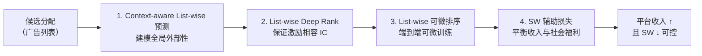

## 一、论文速读摘要

### 论文元信息

- **标题**：NMA: Neural Multi-slot Auctions with Externalities for Online Advertising
- **作者**：Guogang Liao、Xuejian Li、Ze Wang（通讯作者）、Fan Yang、Muzhi Guan、Bingqi Zhu、Yongkang Wang、Xingxing Wang、Dong Wang（共 9 人）
- **机构**：美团（Meituan），北京
- **发表状态**：DLP@RecSys '23（RecSys 2023 的 Deep Learning Practice for High-Dimensional Sparse Data Workshop），2023 年 9 月 18–22 日，新加坡
- **arXiv**：2205.10018（2022-05-20 初版，2023-09-08 修订 v3）
- **篇幅**：10 页、3 图
- **代码**：摘要未提及开源代码，需进一步关注 Papers With Code / GitHub

### 核心贡献（3 句话版本）

1. 提出了 **NMA（Neural Multi-slot Auctions）**，一个端到端可学习的多槽广告拍卖机制，由「context-aware list-wise 预测模块 + list-wise deep rank 模块 + list-wise 可微排序模块 + 社会福利（SW）辅助损失」四部分构成。
2. 解决了传统 GSP 忽略外部性、DNA 只建模局部外部性、VCG/WVCG 无法平衡收入与社会福利的问题，在保证激励相容（IC）的前提下显式建模 ==全局外部性==（广告顺序、位置、上下文）。
3. 在 Avito 公开数据集与美团内部数据上离线验证，并在美团外卖平台做线上 A/B（1% 流量、约一个月），RPM/SWPM/CTR 均优于 GSP/DNA/VCG/WVCG，已实际部署。

> [!abstract] 一句话结论
> 用「可微的深度多槽拍卖」替代工业界通用的 GSP，把广告之间的外部性显式建模进拍卖的分配与计费里，**在激励相容约束下同时提升平台收入并控制社会福利下降**——这是美团自家作品，且已在外卖广告上线。

---

## 二、问题定义与创新点分析

### 2.1 核心问题

在线广告拍卖是社交/电商平台的核心收入来源，工业界几乎都以 **GSP（广义二价拍卖）** 为基准。但 GSP 有一个关键假设：**用户是否点击某条广告只依赖这条广告本身**。现实中这并不成立——一条广告的点击会同时受到：

- **位置外部性（position-dependent externality）**：广告排在哪个槽位；
- **广告间外部性（ad-dependent externality）**：广告前后展示了哪些其他广告/原生内容。

忽略外部性会导致排序与计费次优。已有方法的痛点：

- **DNA（阿里淘宝）**：用 DNN 升级 GSP，但只建模 set-level 的局部外部性，**忽略广告顺序与展示位置**，仍次优。
- **VCG / WVCG**：理论上能建模全局外部性，但 VCG 会显著压低平台收入（工业不可接受），WVCG 参数求解复杂度高（MAB），难以落地。

### 2.2 技术创新层次分析

| 创新层次 | 描述 | 工程价值 |
|---------|------|---------|
| **结构创新** | context-aware list-wise 预测模块，对「候选广告列表 + 拍卖公开信息」做 list-level 建模 | 中等复杂度，直接提升 pCTR/价值估计精度 |
| **原理/结构创新** | list-wise deep rank 模块，把分配与计费参数化为神经网络，端到端可训练且保证 IC | 高风险高回报，需机制设计理论支撑 |
| **训练策略创新** | list-wise 可微排序模块，松弛离散排序算子，让级联 DNN 用真实系统奖励端到端训练 | 改动适中，是端到端训练的关键 |
| **训练策略创新** | SW 辅助损失，在最大化收入的同时约束社会福利下降 | 易落地，改动小 |

### 2.3 与已有方法对比

| 方法 | 外部性建模 | 收入/SW 平衡 | 工业可部署性 |
|------|-----------|-------------|-------------|
| GSP / uGSP | 无（假设点击只依赖广告自身） | 单一收入导向 | 高（基准） |
| Deep GSP / DNA（阿里） | 局部（set-level） | 单目标 | 高 |
| DPIN（美团，position-wise） | 仅位置外部性 | 单目标 | 高 |
| UBM / cascade | 只考虑"前影响后"，忽略"后影响前" | — | 中 |
| VCG | 全局（理论上） | SW 最优但收入下降 | 低 |
| WVCG | 全局（理论上） | 可平衡但参数求解复杂 | 低 |
| **NMA（本文）** | **全局（list-wise）** | **收入 + SW 显式平衡** | **高（已上线）** |

### 2.4 局限性识别

- **Workshop 论文**（DLP@RecSys '23），非主会，学术审稿强度弱于 NeurIPS/ICML/KDD。
- **全排列生成所有候选分配的复杂度是组合爆炸**，论文明确指出工业上需用启发式或 Seq2slate/PIER 等 list 生成模块替代。
- **无开源代码**，可微排序、奖励驱动的端到端训练需自行实现，复现门槛高。
- 依赖完整广告拍卖基础设施（竞价日志、pCTR、计费/结算链路），纯学术环境难以直接套用。
- 摘要只给定性结论，具体离线/线上提升幅度需看论文实验表格。[^1]

---

## 三、方法解析（NMA 四模块）

### 3.1 整体框架

NMA 把多槽拍卖重构成一个可端到端训练的系统，核心目标为：在 **IC（激励相容）、IR（个体理性）、SW（社会福利）** 约束下最大化平台收入。候选分配以「广告列表」形式表示，四模块依次协作。

### 3.2 Context-aware List-wise 预测模块

- 对**每个候选广告列表（allocation）** 及其拍卖公共信息做 list-level 建模，预测每条广告在该列表/位置下的 pCTR 与价值。
- 关键价值：显式建模 ==全局外部性==（列表内广告的顺序、位置、相互影响），相比 DNA 的 set-level 建模更完整。

### 3.3 List-wise Deep Rank 模块（保证 IC）

- 把「分配方案 + 支付规则」**参数化为神经网络**，使其能在端到端学习中被优化。
- 关键价值：在扩大机制设计空间的同时，通过结构设计保证 ==激励相容性（IC）==，避免学出一个可被广告主操纵的机制。

### 3.4 List-wise 可微排序模块

- 拍卖涉及离散的排序/选择操作，无法直接反向传播；该模块用 ==可微排序==（微分松弛）替代离散 top-k。
- 关键价值：让级联的深度网络能接收**真实系统奖励反馈**做端到端训练，实现"离线学习 → 线上奖励"的闭环。

### 3.5 SW 辅助损失

- 在最大化收入的主目标之外，加入**社会福利辅助损失**。
- 关键价值：在提升收入的同时，**有效控制社会福利的下降幅度**，实现收入与福利的显式平衡。

---

## 四、实验与效果

### 4.1 离线实验

- **数据集**：Avito（公开数据集）+ 美团内部工业数据集。
- **指标**：RPM（每千次展示收入）、SWPM（每千次展示社会福利）、CTR。
- **结论**：NMA 在 RPM/SWPM/CTR 上均优于 GSP、DNA、VCG、WVCG；能有效建模全局外部性；相比 VCG，收入更高且 SW 下降可控。
- **pCTR 模型（CLPM）**：AUC ≈ 0.708（±0.0008）。

### 4.2 在线 A/B

- **流量**：美团外卖平台生产流量的 1%。
- **周期**：2022-05-20 ~ 2022-06-20（约一个月）。
- **结论**：NMA 相对 GSP/DNA/WVCG 获得更高收入，且社会福利下降可控。

### 4.3 部署

NMA 已成功部署于**美团外卖平台**的广告场景，是"神经拍卖机制"从学术走向工业的完整案例。

---

## 五、工程落地可行性评估

### 5.1 数据需求

- **数据量**：Avito + 美团内部数据，属工业规模；需竞价日志、曝光/点击、计费金额等特征。
- **特征依赖**：不依赖知识图谱/多模态，但依赖完整的拍卖上下文（候选广告集合、位置、竞价值）。
- **标注成本**：点击/计费为自然反馈，无需人工标注。

### 5.2 计算开销

- **训练**：端到端级联训练 + 可微排序，模型本体是 list-wise ranker，中等 GPU 需求即可。
- **推理（关键）**：多槽拍卖需实时决策；全排列生成候选分配是组合瓶颈，**必须用 list 生成模块替代**才能满足线上 SLA。论文已上线验证可行。
- **内存**：list-wise 建模需对每个候选列表做前向，需控制候选数与列表长度。

### 5.3 实现复杂度评估

| 维度 | 评估 |
|------|------|
| 依赖框架 | PyTorch 标准模块可实现，但可微排序/奖励训练需自定义算子，**中高复杂度** |
| 是否有代码 | 无官方开源，需从零实现或参考第三方复现 |
| 数学难度 | 需拍卖机制设计（IC/IR/SW）+ 可微优化背景，**需要特定领域基础** |
| 系统改造 | 拍卖机制与排序系统深度耦合改造，**整体架构级改动** |

### 5.4 综合落地评分：⭐⭐⭐⭐（4/5）

- **优点**：已有美团生产验证 + 线上 A/B，思路与价值明确，属于"神经拍卖"路线的标杆。
- **风险**：无代码、依赖广告拍卖基建、可微排序与端到端训练实现成本高。
- 对有广告拍卖基建的团队：⭐⭐⭐⭐⭐；对无此基建的团队：⭐⭐⭐。

---

## 六、复现步骤拆解

### Phase 1：快速验证（1–3 天）
1. 精读 Method，理清四模块与 IC/IR/SW 约束的对应关系。
2. 用 Avito 公开数据搭最小 demo：list-wise pCTR 预测 + GSP/DNA/NMA 对比，确认 RPM/SWPM/CTR 趋势一致。

### Phase 2：离线复现（3–7 天）
1. 数据适配：把竞价日志对齐成「候选广告集合 + 中标列表 + 计费 + 点击」格式。
2. 实现 list-wise 预测模块（可用 self-attention/Transformer 建模列表级上下文）。
3. 实现可微排序（可微 top-k / sinkhorn 类松弛）。
4. 加 SW 辅助损失，先用论文超参，再用内部数据调优。

### Phase 3：工程化（1–2 周）
1. 用 list 生成模块（启发式 / Seq2slate / PIER）替代全排列，控制候选数。
2. 模型量化 / 计算图优化，压 P99 延迟。
3. 训练-服务特征对齐（防 Training-Serving Skew）。
4. AB 测试（参考论文：1% 流量、约一个月）。

### 关键复现检查点
- [ ] RPM/SWPM/CTR 相对 GSP 是否正提升
- [ ] 可微排序替换后，IC 是否仍成立、收益是否掉
- [ ] 全排列替换为 list 生成后，效果损失是否可接受

---

## 七、美团业务场景适配建议

> [!important] 特别说明
> 本文本身就是美团外卖广告的作品，且已在该场景上线。所以不是"要不要适配美团"，而是"如何推广到美团更多场景 + 下一步如何演进"。

### 可直接迁移的场景
- **搜索广告**：Query 上下文 + 位置外部性天然契合 list-wise 建模，把 query 作为列表上下文入模。
- **到店 / 酒旅 / 买菜 / 闪购等 LBS 广告**：把地理、时段作为列表上下文，建模跨商家外部性。
- **信息流混排广告**：广告与原生内容混排时外部性更强（广告受前后原生内容影响），NMA 思路直接适用。

### 改进方向
1. **效率**：用学习式 list 生成（Seq2slate / PIER）替代全排列，进一步降复杂度。
2. **多目标**：在 SW 辅助损失基础上，加入广告主 ROI/预算消耗、用户体验（负反馈）约束。
3. **机制层**：结合 reserve price、预算平滑（budget pacing）、长期价值（long-term treatment effect）。

### 演进方向（美团后续工作）
- **DPIN（position-wise externalities）**：建模位置外部性。
- **two-stage auction（[[MIAA_论文精读|Deep Automated Mechanism Design]]）**：整合广告拍卖与分配。
- **NGA（2025，非自回归生成式拍卖）**：显式建模广告间 + 与原生内容的外部性，用并行解码提升效率。

NMA 可视为美团这条"神经拍卖"路线的起点。

---

## 八、注意事项与风险提示

> [!warning] 风险提示
> 1. **可信度**：Workshop 论文（DLP@RecSys '23），非主会严格同行评审；但作者为美团工业团队 + 真实部署 + 线上 A/B，工业可信度较高。
> 2. **数值口径**：不同数据集上 RPM/AUC 不可直接横向比较，只看相对提升（delta）；具体数值以论文表格为准。
> 3. **无代码**：复现需自行实现可微排序与端到端奖励训练，是最大工程门槛。
> 4. **场景依赖**：方法依赖拍卖基础设施与计费链路，普通推荐系统无法直接复用。
> 5. **时效性**：拍卖机制与神经拍卖方向更新较快，建议结合美团后续工作（NGA、DPIN 等）一起评估。

---

[^1]: 论文摘要仅给出"收入更高、社会福利下降可控"的定性结论，逐项 RPM/SWPM/CTR 的提升幅度需查阅正文实验表格。
