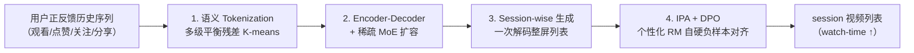
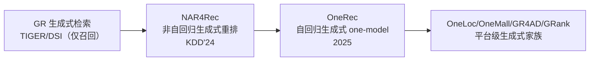

> [!abstract] 一句话结论
> 用「encoder-decoder + 稀疏 MoE」的**单阶段生成式模型**取代工业界「召回-粗排-精排」的多级级联框架，再叠加 **session-wise 会话级列表生成 + 个性化 reward model 的自硬负样本 + 迭代偏好对齐（IPA）+ DPO**，端到端对齐用户兴趣——快手短视频主场景（数亿 DAU）上线后 **watch-time +1.6%**，是生成式推荐从「检索层 selector」走向「主排序 one-model」的里程碑之作。

---

## 一、论文速读摘要

### 1.1 论文元信息

- **标题**：OneRec: Unifying Retrieve and Rank with Generative Recommender and Iterative Preference Alignment
- **作者**：Jiaxin Deng（并列一作）、Shiyao Wang、Kuo Cai、Lejian Ren、Qigen Hu、Weifeng Ding、Qiang Luo、Guorui Zhou（通讯作者）——共 8 人
- **机构**：快手（KuaiShou Inc.），北京
- **发表状态**：arXiv 2502.18965，2025-02-26 提交（仅 v1），cs.IR；**尚未见顶会录用记录，属直接商用的工业预印本**
- **代码**：**无官方开源**（代码地址：无）
- **部署**：快手主场景（短视频推荐，数亿 DAU），watch-time +1.6%

### 1.2 核心贡献（3 句话版本）

1. 提出了 **OneRec**，用统一的 encoder-decoder 生成式模型（配合稀疏 MoE 扩容）取代级联「召回-粗排-精排」多阶段框架，实现**单阶段端到端生成**，是首个在真实场景显著超越多级精排系统的端到端生成式推荐模型。
2. 提出 **session-wise 会话级列表生成**（一次生成整屏 session，而非逐点 next-item 预测 + 手工规则拼接），并设计「多级平衡残差量化（解决 RQ-VAE 的 hourglass 码本不平衡）+ 个性化 reward model 的自硬负样本采样 + **迭代偏好对齐（IPA）+ DPO**」来对齐用户兴趣。
3. 在快手主场景（数亿 DAU 短视频平台）离线 + 线上 A/B 验证，**watch-time 提升 1.6%**，证明有限数量的 DPO 样本即可显著提升生成结果质量。

---

## 二、问题定义与创新点分析

### 2.1 核心问题

为平衡效率与效果，现代推荐系统普遍采用**级联（cascade）三阶段**：召回 → 粗排 → 精排，每阶段各自选 top-k 传给下一阶段。痛点：

- **阶段割裂**：各 ranker 独立优化，上一阶段的效果是下一阶段的**上界**，限制了整体性能上限。
- **生成式检索（GR）止步于召回**：TIGER / DSI 等把 item 用语义 ID 编码、自回归生成，但**只当召回的 selector**，精度打不过精排，无法进入主排序链路。
- **逐点生成的固有缺陷**：传统 next-item 预测是 point-by-point 生成，需要手工规则（去重/多样性/连贯性）才能拼出整屏结果。

### 2.2 技术创新层次分析

| 创新层次 | 描述 | 工程价值 |
|---------|------|---------|
| **结构创新** | encoder-decoder 单阶段生成框架 + 稀疏 MoE 扩容（受 LLM scaling law 启发） | 高风险高回报，重写整个推荐流水线 |
| **结构创新** | session-wise 会话级列表生成，替代逐点预测 + 手工规则 | 中等复杂度，直接提升列表连贯性与多样性 |
| **训练策略创新** | IPA + DPO：个性化 reward model 打分 + 自硬负样本采样 + 迭代偏好对齐 | 易落地，是推荐场景 DPO 的关键适配 |
| **工程创新** | 多级平衡残差 K-means 语义 tokenization（解决 hourglass 码本不平衡） | 中复杂度，影响语义 ID 质量与生成稳定性 |

### 2.3 与已有方法对比

| 方法 | 框架 | 生成方式 | 偏好对齐 | 工业验证 |
|------|------|---------|---------|---------|
| 传统级联（召回+粗排+精排） | 多阶段 | 非生成 | 无 | 基准（快手现网） |
| TIGER / DSI / GENRE | GR，生成式检索 | 逐点自回归 | 无 | 仅召回 selector |
| NAR4Rec（快手，KDD'24） | 生成式重排 | **非自回归**列表生成 | 无 | 快手全量（重排层） |
| S-DPO 等 LM-based Rec | 生成式 | 逐点 | DPO（多负样本） | 学术 |
| **OneRec（本文）** | **生成式 one-model** | **session-wise 自回归** | **IPA + DPO（个性化 RM）** | **快手主场景上线** |

> [!note] OneRec 与 NAR4Rec 的关系（同为快手生成式推荐线）
> [[NAR4Rec_论文精读|NAR4Rec]]（KDD'24）是**非自回归**生成式**重排**（精排之后的重排层），OneRec（2025）是**自回归**生成式**主排序 one-model**（取代整个级联）。两者是快手「生成式推荐」家族的两个阶段：NAR4Rec 让生成式进入重排，OneRec 让生成式直接取代检索+排序。后续还有 OneLoc / OneMall / GR4AD / GRank / PROMISE 等扩展成平台级体系。

### 2.4 局限性识别

- **未正式录用**：仅 arXiv v1，无顶会同行评审记录，属于「直接商用」的工业预印本，理论严谨性待考证。
- **无开源代码**：tokenization + MoE + DPO/IPA 需从零实现，复现门槛高。
- **自回归推理延迟**：session-wise 自回归解码天然比非自回归（如 NAR4Rec）慢，依赖工程优化（MoE 稀疏、beam 控制）才满足线上 SLA。
- **reward model 依赖**：IPA/DPO 效果受 reward model 打分质量约束，RM 训练偏差会传导到偏好对齐。
- **冷启动**：依赖用户正反馈历史序列，新用户/新 item 场景受限。
- **数值口径**：摘要仅给出「watch-time +1.6%」与定性结论，离线各指标精确值以论文表格为准。

---

## 三、方法解析（OneRec 四组件）

### 3.1 整体框架

### 3.2 语义 Tokenization（多级平衡残差量化）

- **动机**：把 item 的**多模态 embedding** $\bm e_i$ 转成语义 token 序列，才能让生成模型像「生成句子」一样生成视频列表。
- **痛点**：主流 RQ-VAE 残差量化存在 **hourglass 现象**（码本分布极度不平衡，大量 item 挤进少数码、多数码稀疏），降低语义 ID 质量。
- **方案**：用 **Balanced K-means** 做多级残差量化——每级把 item 集**均匀**切成 K 簇，逐级编码残差：

$$s_i^l=\arg\min_k\big\|\bm r_i^l-\bm c_k^l\big\|_2^2,\qquad \bm r_i^{l+1}=\bm r_i^l-\bm c_{s_i^l}^l$$

  逐级得到语义 ID $(s_i^1,\dots,s_i^L)$，保证每级码本 $C_l$ 使用均衡。

### 3.3 Encoder-Decoder + 稀疏 MoE

- **编码**：把用户正反馈历史序列 $\mathcal H_u=\{v_1^h,\dots,v_n^h\}$ 编码成上下文表示。
- **解码**：逐 token 自回归解码出目标 session $\mathcal S=\{v_1,\dots,v_m\}$。
- **扩容**：受 LLM **scaling law** 启发，发现推荐模型容量扩大也能稳定涨点，于是用**稀疏 MoE** 扩参数而不等比增加 FLOPs。

### 3.4 Session-wise 会话级生成

- 传统逐点（point-by-point）next-item 预测需要**手工规则**去重/保证连贯/多样性。
- Session-wise 一次性生成整屏 session，模型**自学习最优列表结构**，更连贯、上下文更协调。

### 3.5 迭代偏好对齐（IPA）+ DPO

- **推荐场景 DPO 的关键矛盾**：NLP 里可同时获得正负样本，但推荐**每个浏览请求只展示一次结果**，无法同时拿到 chosen/rejected。
- **解决方案**：
  1. 训练一个**个性化 reward model（RM）**模拟用户打分；
  2. 从 **beam search 结果**里做**自硬负样本采样**（self-hard negative，而非随机采样）；
  3. 用 RM 分数对采样响应排序，选出 **best-chosen / worst-rejected** 构造偏好对；
  4. 用 **DPO** 直接优化策略，并**迭代（IPA）**更新偏好数据。
- **结论**：有限数量的 DPO 样本即可对齐用户兴趣，显著提升生成质量。

---

## 四、实验与效果

### 4.1 离线实验

- **指标**：session watch time（swt，会话观看时长）、view probability（vtr，观看概率）。
- **基线**：SASRec、TIGER 等强基线。
- **结论**：OneRec-1B + IPA 在所有指标上均优于基线；swt 提升约 **+0.646**（10.456 → 11.102）；对比 TIGER-1B，session watch time 约 **0.7646 vs 0.6776**。消融实验证明 MoE 扩容、session-wise 生成、IPA/DPO 各模块均有效。

### 4.2 在线 A/B

- **场景**：快手主场景（短视频推荐，数亿 DAU）。
- **结论**：**watch-time 提升 1.6%**，被论文称为「substantial improvement」。

### 4.3 部署

- 已部署于快手主场景，是生成式推荐从「检索层」进入「主排序链路」的工业验证样本。

---

## 五、工程落地可行性评估

### 5.1 数据需求

| 维度 | 评估 |
|------|------|
| 数据量 | 快手工业数据（数亿 DAU 短视频），工业规模 |
| 特征依赖 | 依赖 item 多模态 embedding + 用户正反馈序列，**不依赖知识图谱** |
| 标注成本 | 无人工标注（观看/点赞/关注/分享为正反馈） |
| 特殊要求 | 需多模态预训练表示 + 语义 token 码本构建 + reward model 训练数据 |

### 5.2 计算开销

- **训练**：MoE 扩容参数不等比增 FLOPs，但 DPO/IPA 需额外 RM 打分与采样，中等偏高 GPU。
- **推理（关键）**：session-wise **自回归**解码延迟天然高于非自回归，依赖 MoE 稀疏 + beam 控制 + 工程优化才满足 SLA。
- **内存**：语义 token 码本 + MoE 参数 + 用户历史序列编码，规模可控。

### 5.3 实现复杂度评估

| 维度 | 评估 |
|------|------|
| 依赖框架 | 标准 Transformer/MoE 可搭，但平衡残差量化 + 自硬负样本 + DPO 需**自定义**，中高复杂度 |
| 是否有代码 | **无官方开源**，需从零实现 |
| 数学难度 | 需理解语义 token 量化 + DPO 偏好优化 + MoE，**需一定领域基础** |
| 系统改造 | 重写「召回+粗排+精排」为单模型，**整体架构级重构** |

### 5.4 综合落地评分：⭐⭐⭐⭐（4/5）

- **优点**：快手真实部署 + 线上 A/B + watch-time +1.6%，价值明确；是「生成式推荐 one-model」路线标杆。
- **风险**：无代码、自回归延迟、依赖生成式推荐基建 + reward model，是**架构级重构**（非模型层小改）。
- 对有生成式推荐/one-model 规划的团队：⭐⭐⭐⭐⭐；对只想改单个 ranker 的团队：⭐⭐。

---

## 六、复现步骤拆解

### Phase 1：快速验证（1–3 天）
1. 精读 Method，理清「语义 token → encoder-decoder/MoE → session-wise 生成 → IPA/DPO」链路。
2. 用小型公开数据集（如 Amazon / MovieLens）搭最小 demo：item embedding → 残差 K-means 语义 ID → 自回归生成 session，验证能跑通。

### Phase 2：离线复现（3–7 天）
1. 数据适配：把行为日志对齐成「用户正反馈序列 → 目标 session 列表」格式。
2. 实现多级平衡残差 K-means tokenization（注意解决 hourglass 现象）。
3. 实现 encoder-decoder + 稀疏 MoE，先做 session-wise 生成预训练。
4. 训练个性化 reward model，做自硬负样本采样，加 IPA + DPO 迭代对齐。
5. 离线对比 SASRec / TIGER / 现网级联，看 swt / vtr 提升。

### Phase 3：工程化（1–2 周）
1. 自回归解码加速（MoE 稀疏、beam/prefix 约束、量化）。
2. 语义 token 码本与多模态 embedding 离线预计算 + 在线缓存。
3. reward model 与生成模型 Serving 对齐，防 Training-Serving Skew。
4. 压测 P99 延迟，小流量 AB，监控 watch-time / 观看时长 / 转化。

### 关键复现检查点
- [ ] swt / vtr 相对现网级联是否正提升
- [ ] DPO 样本是否少量即可对齐兴趣（对齐论文「有限样本即有效」结论）
- [ ] 自硬负样本 vs 随机负样本的增益是否符合论文
- [ ] 自回归延迟是否满足线上 SLA

---

## 七、美团业务场景适配建议

> [!important] 特别说明
> OneRec 是「生成式推荐 one-model」路线的**快手开山作**，与美团正在推进的生成式推荐（MTGR）与生成式广告 one-model（UniROM / EGA-V1）直接对标。本文对美团最大的可迁移点不是「整框架照搬」，而是 **DPO 在推荐场景的适配范式：个性化 reward model 打分 + 自硬负样本采样 + 迭代偏好对齐**——这恰好是你（美团零售广告搜索机制）在「生成式拍卖 G-E」里「用 DPO 替代原 loss」时可以直接借鉴的工程细节。

### 7.1 分场景适配分析

| 场景 | 适配点 | 挑战 |
|------|--------|------|
| **短视频/信息流推荐** | 与论文同构，session-wise 生成 + DPO 直接可用 | 需多模态 embedding 与语义 token 基建 |
| **广告 one-model** | DPO 偏好对齐可迁移到「生成式拍卖 G-E」：用 reward model 给生成序列打分、自硬负样本构造 chosen/rejected | 广告需对齐**多目标**（收入/转化/用户体验），RM 需建模商业价值而非单一 watch-time |
| **搜索广告机制** | 拍卖与混排统一决策 + DPO 对齐，可复用 OneRec 的 IPA 迭代对齐思路 | 需在 IC/IR 约束下做偏好对齐，不能破坏机制经济性质 |
| **本地生活（到店/外卖）** | 快手 OneLoc 已证明 geo-aware 生成式推荐可行，OneRec 是基座 | LBS 特征需注入语义 token 与 RM 打分 |

### 7.2 改进方向

1. **多目标 reward model**：把 OneRec 的单一 watch-time RM 升级为「收入 + 转化 + 用户体验」多目标 RM，适配广告/拍卖场景。
2. **非自回归加速**：借鉴 [[NAR4Rec_论文精读|NAR4Rec]] 的非自回归解码，缓解自回归 session 生成的延迟瓶颈（快手后续 GR4AD 的 LazyAR 亦是此思路）。
3. **机制约束下的 DPO**：在生成式拍卖中，把 IC/IR 约束作为偏好对齐的硬约束（类似 DNA 的结构性保证），避免 DPO 对齐破坏机制经济性质。
4. **reward model 与预估模型协同**：RM 打分可复用现网 pCTR/pCVR 预估，降低额外训练成本。

### 7.3 演进脉络（本文在体系中的定位）

---

## 八、注意事项与风险提示

> [!warning] 风险提示
> 1. **可信度**：仅 arXiv v1，**未见顶会录用**，属「直接商用」的工业预印本，学术严谨性弱于 KDD/RecSys 主会论文；但快手真实部署 + 线上 watch-time +1.6%，工业可信度较高。
> 2. **数值口径**：不同数据集/指标不可横向比较，只看相对提升（delta）；具体数值以论文表格为准。
> 3. **无代码**：tokenization + MoE + DPO/IPA 需自行实现，是最大工程门槛。
> 4. **场景依赖**：依赖多模态 embedding、语义 token 码本、reward model、生成式 serving 一整套基建，传统 ranker 无法直接复用。
> 5. **时效性**：2025 年的快手开山作，后续已被 OneLoc/OneMall/GR4AD/GRank/PROMISE 等平台级工作扩展，复现前务必结合美团 MTGR / UniROM 及腾讯 GPR / OneRanker 一起评估。
