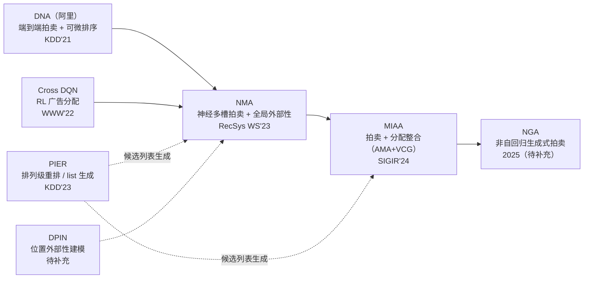

> [!abstract] 索引说明
> 本索引梳理美团在「**广告拍卖 / 分配 + 外部性建模**」这条技术脉络上的工作，与「排序大模型路线」是不同主线。核心命题：传统 GSP 假设点击只依赖广告自身，忽略位置与上下文（==外部性==），导致排序与计费次优；后续工作用深度学习/机制设计把外部性显式建模进拍卖与分配，同时保证 ==激励相容（IC）== 与 ==个体理性（IR）==。

## 一、脉络总览

- **主线**：广告分配（RL）→ 多槽拍卖（全局外部性）→ 拍卖与分配整合 → 生成式拍卖；其中 **DNA（阿里）是「神经拍卖」思路的工业起点/对标**，美团 NMA 在其上把外部性从 set-level 升级到 list-wise。
- **侧线**：排列级重排（PIER）作为候选列表生成模块，位置外部性建模（DPIN）作为外部性建模的并行补充。

## 二、已有笔记

| 工作 | 主题 | 会议 | 状态 |
|------|------|------|------|
| [[DNA_论文精读\|DNA]] | 阿里端到端拍卖（Deep Neural Auction）：集合编码 + 单调网络 + 可微排序，本路线起点/对标 | KDD 2021 | ✅ 已精读 |
| [[Cross_DQN_论文精读\|Cross DQN]] | 用强化学习（跨请求 DQN）做信息流广告分配（placement） | WWW 2022 | ✅ 已精读 |
| [[NMA_论文解读\|NMA]] | 端到端多槽拍卖：list-wise 建模全局外部性 + 可微排序 + SW 辅助损失 | DLP@RecSys '23 | ✅ 已解读 |
| [[MIAA_论文精读\|MIAA]] | 深度自动化机制整合拍卖与分配（AMA + VCG） | SIGIR 2024 | ✅ 已精读 |
| [[PIER_论文精读\|PIER]] | 排列级兴趣端到端重排框架（可作 list 生成模块） | KDD 2023 | ✅ 已精读 |

## 三、待补充（尚无笔记）

- **DPIN（Deep Position-wise Interaction Network）**：美团，建模位置外部性，与 NMA 的外部性建模互为补充。
- **NGA（Non-autoregressive Generative Auction with Global Externalities）**：美团 2025，生成式拍卖 + 并行解码，是这条脉络的最新演进。
- **two-stage auction / Deep Automated Mechanism Design**：拍卖与分配的整合（即 MIAA 的完整形态）。

## 四、核心概念速查

| 概念 | 全称 / 含义 |
|------|------------|
| GSP | Generalized Second Price，广义二价拍卖（工业基准） |
| VCG | Vickrey-Clarke-Groves，社会福利最优但平台收入偏低 |
| AMA | Affine Maximizer Auction，仿射最大化拍卖 |
| 外部性 | 广告 CTR 受位置、上下文、周围广告/原生内容影响 |
| IC | 激励相容：广告主真实出价是其最优策略 |
| IR | 个体理性：广告主支付不超过其最大支付意愿 |
| SW | Social Welfare，社会福利 |
| RPM / SWPM | 每千次展示收入 / 社会福利 |
